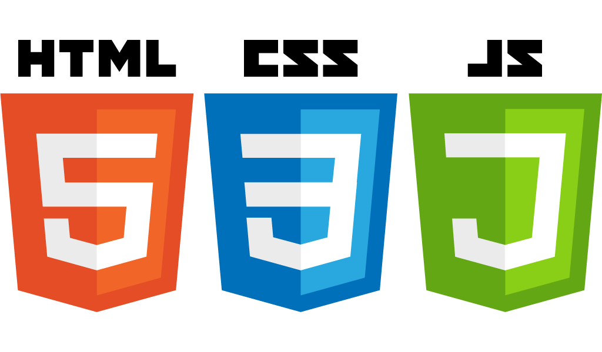

# Chat App

## Deployment
http://ai-zixun.com/chat-app

## Web Technology Used in this project 

#### Front-End: React.js; Bootstrap 4; HTML; CSS; Javascript 
<p align="center">
  
  
  
</p>

#### Back-End: Python + Flask + Socket IO
<p align="center">
  
  
  
</p>

#### Deployment: AWS Elastic Beanstalk + Docker 
<p align="center">
  
  
</p>


## Overview 
A personal project to learn the basic web technology with React for the front-end development, Flask Python Server for the back-end development, and AWS Elastic Beanstalk and Docker for the final deployment. Using this project as an oppotunity to gain in-depth understanding of the Full-Stack Web Development.


## Instruction to Run Locally (via Docker)

1. Make sure that your local environment has docker installed 
 1. Please refer to the Docker documation on installation: https://docs.docker.com/install/ 
2. Navigate to the project directory 
3. Build Docker Image at the current directory 
```
docker image build -t chatapp .
```
4. Execute the Docker image 
```
docker run chatapp
```
...


